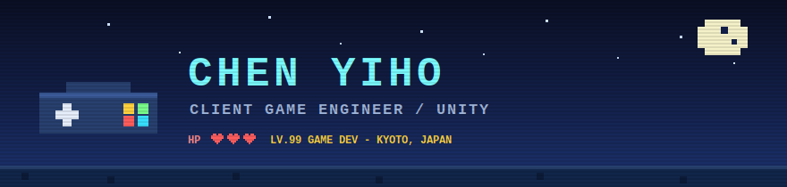
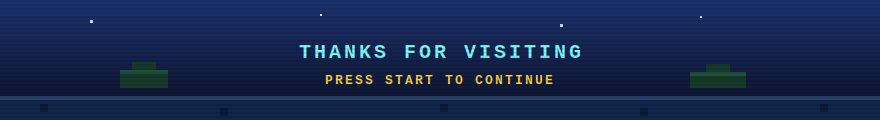

<p align="center">
  
</p>

<p align="center">
  
</p>

<p align="center">
  <a href="https://github.com/SonaruIsuge">
    
  </a>
  <a href="https://www.linkedin.com/in/yi-ho-chen-914aa6293/">
    
  </a>
  
</p>

---

## About Me

```yaml
role: Client Game Engineer
country: Taiwan
locate_in: Kyoto, Japan
current_focus: Game Development
main_engine: Unity
programming_languages:
  - C
  - C++
  - C#
  - python
  - javascript
languages:
  - Chinese
  - English
  - Japanese
interests:
  - Game Engineering
  - Development Tools
  - Code Structure
  - Performance Optimization
  - Clean Architecture
```

---

## Tech Stack

###  Game Development

<p>
  
  
  
  
</p>

###  Programming Languages

<p>
  
  
  
  
  
</p>

###  Tools

<p>
  
  
  
  
  
</p>

###  AI Tools I Use

<p>
  
  
  
</p>

---

## What I Like to Build

<table>
  <tr>
    <td align="center" width="25%">
      <br />
      Unity client gameplay &amp; features
    </td>
    <td align="center" width="25%">
      <br />
      Editor tools, workflows &amp; automation
    </td>
    <td align="center" width="25%">
      <br />
      Maintainable, readable architecture
    </td>
    <td align="center" width="25%">
      <br />
      Runtime perf &amp; iteration speed
    </td>
  </tr>
</table>

---

## GitHub Stats

<p align="center">
  
  
</p>

<p align="center">
  
</p>

<p align="center">
  
</p>

---

## Favorites

### Games

<p>
  
  
  
  
  
</p>

### Anime

<p>
  
  
  
</p>

---

## When I’m Not Coding

```text
> Game
> Anime
> Idol
> Music
> Travel
```

---

<p align="center">
  
</p>
